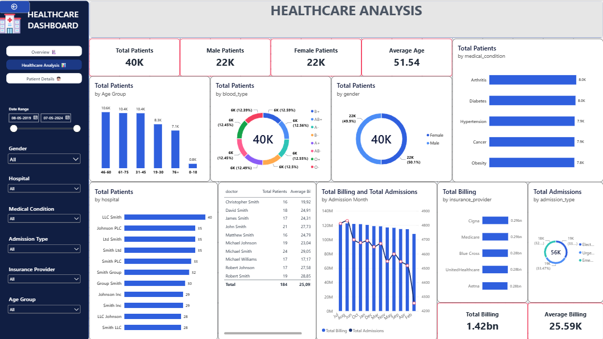

# 🏥 Healthcare Analytics Dashboard

A practical **Healthcare Analytics Dashboard** project built to simulate an industry-style healthcare reporting and analytics workflow.

The objective is not to create a dashboard with a large number of charts. Instead, the project focuses on answering important healthcare management questions around:

- Patient population
- Medical conditions
- Hospital performance
- Doctor/provider performance
- Admissions
- Insurance
- Billing and financial activity
- Treatment patterns
- Patient-level admission details

The final Power BI solution uses **2 analytical dashboard pages** plus a separate **Patient Details** drill-through page.

---

## 📌 Project Overview

Healthcare organizations generate patient, admission, treatment, hospital, insurance, and billing data.

This project converts a raw healthcare dataset into a structured analytical solution using:

**Python → SQL → Power BI**

### Main objective

Build a simple but useful healthcare analytics solution that allows a user to move from:

> **What is happening? → Where is it happening? → What should we investigate? → Which patient/admission records are involved?**

The dashboard is intentionally kept to **two main analytical pages** so that each page has a clear purpose instead of creating many pages filled with visuals.

---

# 🎯 Business Questions

## Patient & Demographics

- How many patients are represented in the dataset?
- What is the patient age distribution?
- What is the gender distribution?
- How are patients distributed across blood types?
- Which age groups contain the largest patient populations?

## Medical Conditions & Treatment

- Which medical conditions affect the most patients?
- Which conditions generate the highest billing amounts?
- What is the average length of stay for different conditions?
- Which medications are commonly used?
- What are the most common test results?

## Hospital & Provider Performance

- Which hospitals have the highest patient volume?
- How many doctors operate across hospitals?
- Which doctors handle the highest patient volumes?
- What is the average billing associated with doctors?
- How does hospital activity change over time?

## Admissions

- How are admissions distributed by admission type?
- How many admissions occur over time?
- What is the average patient age for different admission types?
- What is the average length of stay?

## Insurance & Financial Analysis

- Which insurance providers cover the largest patient populations?
- Which insurance providers are associated with the highest billing?
- What is the total billing amount?
- What is the average billing amount?
- How does billing vary across hospitals and medical conditions?

## Patient-Level Investigation

- Which patient was admitted?
- Which condition was recorded?
- Which doctor and hospital were involved?
- What were the admission and discharge dates?
- What was the length of stay?
- What medication and test result were recorded?
- What was the patient's billing amount?

---

# 🗂️ Dataset

The healthcare dataset contains patient and admission information including:

| Column | Description |
|---|---|
| `Name` | Patient name |
| `Age` | Patient age |
| `Gender` | Patient gender |
| `Blood Type` | Patient blood type |
| `Medical Condition` | Recorded medical condition |
| `Date of Admission` | Admission date |
| `Doctor` | Treating doctor |
| `Hospital` | Hospital name |
| `Insurance Provider` | Insurance provider |
| `Billing Amount` | Patient billing amount |
| `Room Number` | Assigned room |
| `Admission Type` | Type of admission |
| `Discharge Date` | Discharge date |
| `Medication` | Medication recorded |
| `Test Results` | Test result |

---

# 🔄 Project Workflow

```text
Raw Healthcare Dataset
        │
        ▼
Python Data Inspection
        │
        ▼
Data Cleaning & Validation
        │
        ▼
SQL Analytical Queries
        │
        ▼
Final Analytical CSV Files
        │
        ▼
Power BI
        │
        ├── Page 1: Healthcare Management Overview
        │
        ├── Page 2: Healthcare Analysis
        │
        └── Page 3: Patient Details
```

---

# 🐍 1. Python — Data Preparation

Python was used for the data preparation stage.

### Main responsibilities

- Inspect dataset structure
- Check column names and data types
- Identify missing values
- Check duplicate records
- Review invalid or inconsistent values
- Validate date columns
- Review numerical fields
- Check categorical values
- Calculate/validate length of stay
- Prepare reliable data for SQL analysis

The purpose of Python was primarily **data quality and preparation**, rather than dashboard visualization.

---

# 🗄️ 2. SQL — Analytical Layer

SQL was used to transform cleaned healthcare data into business-oriented analytical outputs.

Instead of creating many small SQL questions, the project uses **consolidated analytical queries**, with each major query producing a useful output for Power BI.

### Executive Healthcare Summary

Includes:

- Total admissions
- Total hospitals
- Total doctors
- Total medical conditions
- Total insurance providers
- Total billing amount
- Average billing amount
- Average patient age
- Earliest admission date
- Latest admission date

### Patient Demographics

Includes:

- Age group
- Gender
- Blood type
- Patient count
- Average age
- Total billing amount
- Average billing amount

### Medical Condition Analysis

Includes:

- Medical condition
- Patient count
- Average patient age
- Total billing amount
- Average billing amount
- Male patients
- Female patients
- Average length of stay

### Hospital Performance

Includes:

- Hospital
- Patient count
- Unique doctor count
- Medical condition count
- Total billing amount
- Average billing amount
- Average patient age
- Average length of stay
- First admission date
- Last admission date

### Admission Analysis

Includes:

- Admission year
- Admission month
- Admission month number
- Admission type
- Patient count
- Average age
- Total billing amount
- Average billing amount
- Average length of stay

### Doctor Performance

Includes:

- Doctor
- Hospital
- Patient count
- Medical condition count
- Total billing amount
- Average billing amount
- Average patient age
- Average length of stay
- First admission date
- Latest admission date

### Insurance Analysis

Includes:

- Insurance provider
- Patient count
- Hospital count
- Total billing amount
- Average billing amount
- Average patient age
- Medical condition count

### Monthly Healthcare Activity

Includes:

- Year
- Month
- Month number
- Admission count
- Total billing amount
- Average billing amount
- Average patient age
- Average length of stay

### Patient Admission Detail

Provides patient-level information used for investigation and drill-through.

---

# 📊 3. Power BI Dashboard

The final dashboard is intentionally divided into **two analytical pages** and one supporting detail page.

## Page 1 — Healthcare Management Overview

### Purpose

> **What is happening overall?**

This page provides a high-level management view of the healthcare operation.

### Main information

- Total Patients
- Total Admissions
- Total Billing Amount
- Average Billing Amount
- Average Patient Age
- Patients by Medical Condition
- Admissions Over Time
- Admission Type Distribution
- Patients by Hospital
- Billing by Hospital
- Top Medical Conditions by Billing Amount

### Main filters

- Date Range
- Gender
- Hospital
- Medical Condition
- Admission Type
- Insurance Provider

### Dashboard Preview


---

## Page 2 — Healthcare Analysis

### Purpose

> **Where and why should we investigate further?**

This page combines the deeper analytical areas instead of creating separate pages for every topic.

### Patient Demographics

- Patient population
- Male/female distribution
- Average age
- Age groups
- Blood types

### Medical & Treatment

- Top medical conditions
- Treatment/medication insights
- Test-result patterns
- Length of stay

### Hospital & Provider Analysis

- Top hospitals by patient volume
- Doctor performance
- Hospital activity trends

### Financial & Insurance Analysis

- Billing by insurance provider
- Admission type distribution
- Total billing
- Average billing
- Key financial insights

### Key Insights

The page summarizes important findings across:

- Patient population
- Medical conditions
- Hospitals
- Financial activity

### Dashboard Preview



---

# 👤 Page 3 — Patient Details

The third page is **not intended to be another analytical dashboard**.

It acts as a **patient/admission drill-through page**.

The page provides detailed information such as:

- Patient Name
- Age
- Gender
- Blood Type
- Medical Condition
- Doctor
- Hospital
- Insurance Provider
- Admission Date
- Discharge Date
- Length of Stay
- Admission Type
- Billing Amount
- Medication
- Test Results

### Purpose

The analytical pages answer:

> **What is happening?**

and:

> **Where should we investigate?**

The Patient Details page answers:

> **Which specific patient/admission records are behind the analysis?**

---

# 📈 Dashboard Design Philosophy

A major goal of this project was to avoid the common beginner approach of creating many dashboard pages simply to display more charts.

Instead, the design follows a simple analytical structure:

```text
PAGE 1
Management Overview
"What is happening?"

        ↓

PAGE 2
Healthcare Analysis
"Where should we investigate?"

        ↓

PAGE 3
Patient Details
"What specific records are behind it?"
```

This keeps the dashboard focused on **business questions and investigation**, rather than visual quantity.

---

# 🧠 Analytical Areas Covered

| Area | Analysis |
|---|---|
| Patient Demographics | Age, gender, blood type |
| Medical Conditions | Patient volume, billing, length of stay |
| Treatment | Medication and test results |
| Hospitals | Patient volume, billing, doctors |
| Doctors | Patient volume and billing |
| Admissions | Admission type and time trends |
| Insurance | Patient volume and billing |
| Financial | Total and average billing |
| Patient Details | Individual admission investigation |

---

# 🛠️ Tools & Technologies

### Python

Used for:

- Data inspection
- Cleaning
- Validation
- Preparation

### SQL

Used for:

- Aggregation
- Grouping
- Filtering
- Analytical reporting
- Creating Power BI-ready datasets

### Power BI

Used for:

- Interactive dashboards
- KPI cards
- Charts
- Filters/slicers
- Drill-through analysis
- Healthcare management reporting

---

# 📁 Suggested Repository Structure

```text
Healthcare-Analytics-Dashboard/
│
├── README.md
│
├── data/
│   ├── raw/
│   └── processed/
│
├── python/
│   └── data_cleaning.py
│
├── sql/
│   ├── executive_healthcare_summary.sql
│   ├── patient_demographics.sql
│   ├── medical_condition_analysis.sql
│   ├── hospital_performance.sql
│   ├── admission_analysis.sql
│   ├── doctor_performance.sql
│   ├── insurance_analysis.sql
│   └── monthly_healthcare_activity.sql
│
├── powerbi/
│   └── Healthcare_Analytics_Dashboard.pbix
│
├── images/
│   ├── healthcare_management_overview.png
│   └── healthcare_analysis.png
│
└── documentation/
    └── data_dictionary.md
```

---

# 💡 Key Project Takeaways

This project demonstrates an end-to-end analytics workflow:

**Raw Data → Data Quality → SQL Transformation → Business Questions → Power BI → Insights**

The main learning outcomes include:

- Thinking in terms of business questions rather than individual charts
- Performing data-quality checks before analysis
- Creating reusable analytical SQL outputs
- Designing dashboards around stakeholder questions
- Separating management-level analysis from patient-level investigation
- Using drill-through to move from aggregated information to detailed records
- Building a compact dashboard instead of unnecessarily creating many pages

---

# 🚀 Future Improvements

Potential future improvements include:

- Add year-over-year comparisons using validated historical data
- Add advanced patient segmentation
- Add hospital benchmarking
- Add condition-level cost analysis
- Add readmission analysis if readmission data becomes available
- Add treatment outcome analysis if outcome data becomes available
- Add automated data refresh
- Add Power BI Row-Level Security for role-based access
- Add a documented data dictionary and data-quality report

These are future enhancements because they require additional data or business definitions that are not currently present in the dataset.

---

# 📌 Project Status

**Status:** Completed — Healthcare Analytics Practice Project

**Core workflow:** Python → SQL → Power BI

**Dashboard pages:**

- ✅ Healthcare Management Overview
- ✅ Healthcare Analysis
- ✅ Patient Details / Drill-through

**Primary focus:** Practical healthcare data analysis and business-oriented dashboard design.
